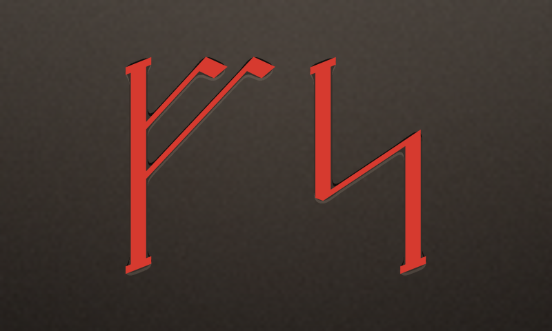

<div align="center">



# MeTube

**A YouTube client for Apple TV, built for one viewer: me.**

[](https://github.com/claust/metube/actions/workflows/tvos-ci.yml)
&nbsp;·&nbsp; tvOS 18+ &nbsp;·&nbsp; SwiftUI &nbsp;·&nbsp; MIT

</div>

---

> **This is a personal project, for my own use only.** It reimplements YouTube's private
> InnerTube API against my own Google account, it is distributed to nobody but me (internal
> TestFlight), and it is not intended, supported, or fit for anyone else's use. The code is
> public because there is no reason to hide it — not because it is a product.

## What it is

A tvOS app that signs into YouTube with the device-activation flow, shows your own Home
recommendations, and plays videos natively in AVPlayer — plus a small Appwrite backend that
keeps watch progress in sync across reinstalls and boxes.

| | |
|---|---|
| **Multiple profiles** | Several YouTube accounts signed in at once, each with its own tokens and watch progress. |
| **Native playback** | HLS from the VISIONOS InnerTube client, 1080p60 H.264 — the ceiling real Apple TV hardware can decode. |
| **Preview on focus** | A focused card plays its video in place, silently, recording nothing. |
| **Shorts** | Their own row and their own portrait tile, lifted out of the shelves YouTube mixes them into. |
| **SponsorBlock** | In-video sponsor reads skipped automatically, looked up by a 4-character hash prefix so the videoId never leaves the device. |
| **Channels** | Hold Select on a card for the channel screen and subscribe/unsubscribe. |
| **History** | Everything already watched, most recent first, built from the synced watch progress — plus the account's history from its other clients. |
| **Top Shelf** | The first two videos of your feed on the tvOS home screen, deep-linking straight into the player. |
| **Watch-progress sync** | Resume positions backed up to a self-hosted Appwrite — with no second login to type on a remote. |

## The two halves

| Directory | What lives there | Docs |
|---|---|---|
| [`YouTubeTV/`](YouTubeTV) | The Apple TV app — SwiftUI, XcodeGen, UI tests, TestFlight scripts. | [YouTubeTV/README.md](YouTubeTV/README.md) |
| [`Backend/`](Backend) | The Appwrite project — watch-progress table and the `metube-auth` function. | [Backend/README.md](Backend/README.md) |
| [`reference/`](reference) | Distilled InnerTube notes and captured sample responses. | [reference/INNERTUBE.md](reference/INNERTUBE.md) |

## Quick start

```sh
brew install xcodegen
cd YouTubeTV
cp Config/Secrets.example.xcconfig Config/Secrets.xcconfig   # then fill it in
xcodegen generate
make run        # build, install and launch on the Apple TV simulator
```

Sign in by visiting the URL the app shows and entering the code. Backend sync stays off until
you point `AP_HOST` / `AP_PROJECT_ID` at your own Appwrite.

Other targets: `make deploy` (a paired Apple TV), `make check` (SwiftLint + swift-format, what
CI gates on), `make test`, `make testflight`. The app-side [README](YouTubeTV/README.md) covers
signing, entitlements and each feature in depth.

## The mark

**ᚠᛋ** — a rune monogram for *Fjernsyn*, the app's App Store name (Danish for *television*):
fehu for "f", long-branch sól for "s", in the red ochre runestone carvings were painted with.
It is generated, not drawn — `YouTubeTV/Scripts/generate-app-icon.py` is the design.

## Licence

[MIT](LICENSE). Not affiliated with, endorsed by, or connected to YouTube or Google.
